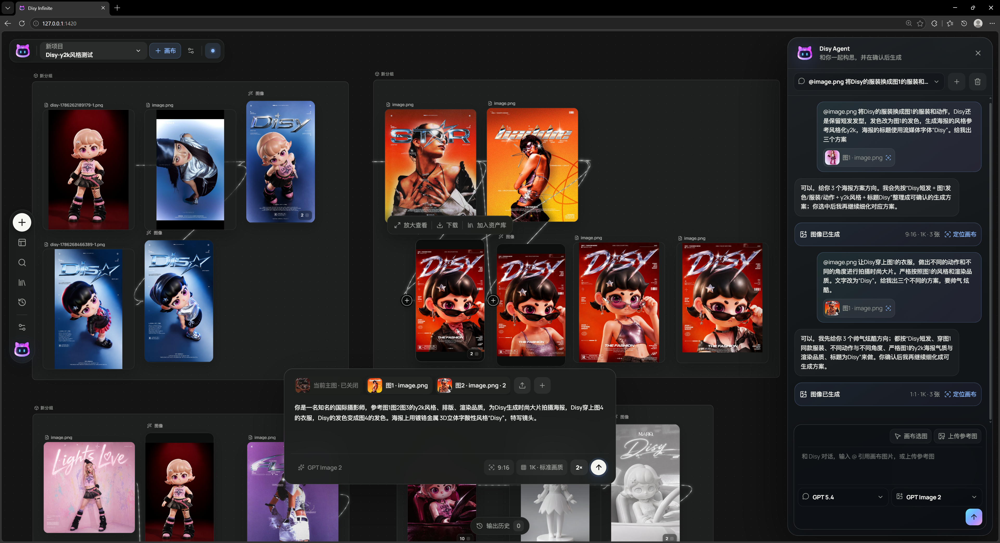
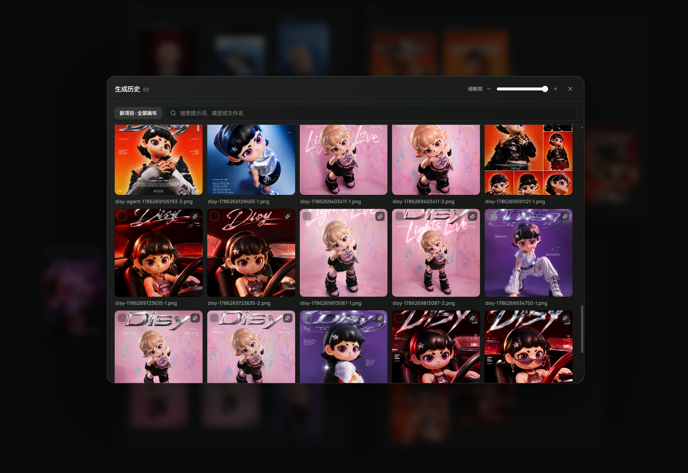
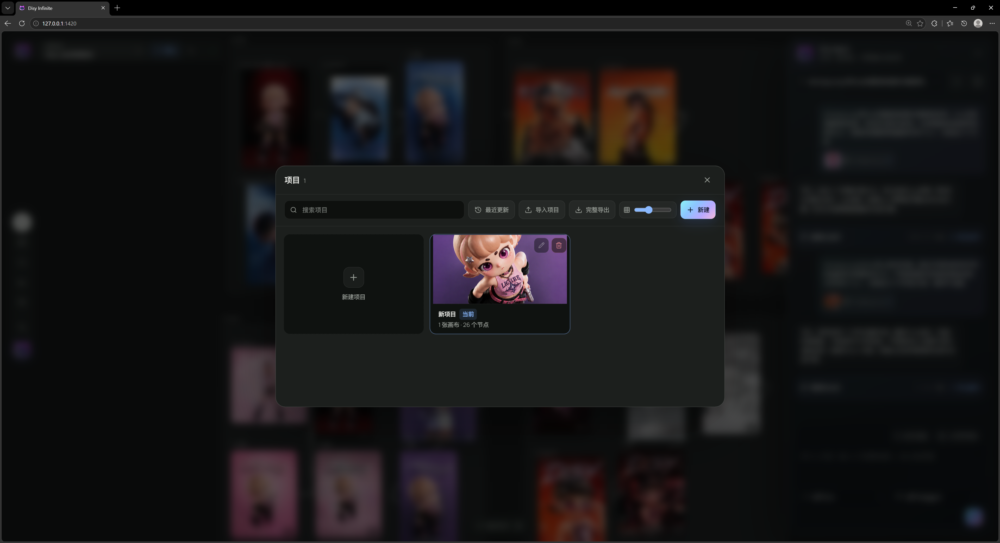

<p align="center">
  <picture>
    <source media="(prefers-color-scheme: dark)" srcset="docs/assets/logo-black.png" />
    <source media="(prefers-color-scheme: light)" srcset="docs/assets/logo-white.png" />
    
  </picture>
</p>

<h1 align="center">DisyLab</h1>

<p align="center">
  简体中文 · <a href="README.zh-TW.md">繁體中文</a> · <a href="README.en.md">English</a>
</p>

<p align="center">
  <strong>让角色、参考、提示词和每一次尝试，都留在同一张会生长的画布上。</strong>
</p>

<p align="center">
  面向设计师、电商视觉工作者与内容创作者的本地优先 AI 无限画布。<br />
  灵感不用排队，方案不再揉成一团，确认之后才让 GPU 开工。
</p>

<p align="center">
  <a href="https://disylab.pages.dev">在线体验</a>
  ·
  <a href="https://tyaash.github.io/DisyLab-Canvas/">项目官网</a>
  ·
  <a href="#核心能力">核心能力</a>
  ·
  <a href="#快速开始">快速开始</a>
  ·
  <a href="#项目文档">项目文档</a>
  ·
  <a href="#开发沟通">开发沟通</a>
  ·
  <a href="#授权与商业使用">授权说明</a>
</p>

<p align="center">
  
  
  
  
</p>

> [!IMPORTANT]
> **DisyLab 是源码公开可见（source-available）的专有软件，不是开源软件。** 未经版权所有者事先书面许可，不得商用、售卖、出租、白标、再分发、再许可或将本项目及其修改版本用于收费服务。查看完整的[中文授权声明](LICENSE.zh-CN.md)与[英文许可证](LICENSE)。

> 这里是 DisyLab v1.0.5。项目、画布、资产、历史和 Agent 会话默认留在你的浏览器里；你的创作是你的，API Key 也是。

## v1.0.5 新增

- **Skill 系统**：图像与文本节点可通过 `/` 打开 Skill，支持即时执行、参数化配置、自定义 Skill 导入管理和安全校验。
- **漫画分镜工作流**：从内容拆解、版式选择、构图确认到素材生成形成可持续编辑的节点流程。
- **文件工具箱**：新增图片、视频与 PDF 的轻量处理入口，支持图片压缩、视频压缩、PDF 压缩与合并。
- **个人中心与项目管理**：项目首页、搜索、列表/宫格、批量选择、导入导出与 API 入口完成统一整理。
- **交互与稳定性修复**：重构全局弹窗层级，修复遮罩穿透、个人中心弹窗被遮挡、小地图拖拽和 Skill 面板可读性问题。


## 在线体验

访问：[https://disylab.pages.dev](https://disylab.pages.dev)

体验版适合测试画布、节点、连线、资产库和生成工作流。首次使用 AI 生成功能前，需要在右上角 API 设置中填写自己的接口地址和 API Key。

请勿使用来源不明的共享 Key，也不要把私人 Key 写入源码、截图或公开 Issue。

## DisyLab 是什么

很多 AI 创作工具只留下最终结果，而灵感、参考图、提示词和生成过程散落在不同窗口里。

DisyLab 希望把这些内容重新放回一张可以持续生长的画布：

- 文本节点记录灵感与提示词。
- 上传节点保存参考素材。
- 图像节点承接生成任务与多个结果版本。
- 连线表达素材、提示词和结果之间的关系。
- 资产库沉淀可复用的节点与组合。
- 历史记录帮助找回生成结果和定位失败原因。

它不是一个只负责“点一下生成”的输入框，而是一间能够保留创作上下文的 AI 工作台。

## 界面预览

### 从一个角色，长出一套视觉世界

角色设定、海报方向、材质实验和变体结果可以同时展开。每条连线都保留创作依据，不用靠记忆猜“这张图当时参考了什么”。



### 三个方向，就是三个方案

Agent 提出多个方向时，Disy 不再把关键词煮成一锅粥。先选择方案一、方案二、方案三或全部，再为每个方向分别展开确认卡；你不点确认，就不会开始生图。


### 好结果不只躺在画布上

满意的角色图和海报可以收进资产库，按项目继续复用；生成历史保留每一次输出，链接失效时也会给出明确的重新关联入口。




### 项目不是一张孤零零的画布

一个项目可以包含多张画布，并自动使用最近的视觉结果作为封面。灵感可以分支，但项目不会失联。



## 核心能力

| 能力 | 当前实现 |
|---|---|
| 无限画布 | 画布平移、缩放、网格、小地图、框选和空白画布快捷创建。 |
| 多类型节点 | 文本、图像生成、上传图片和组合节点，可拖拽、复制、删除、打组和解组。 |
| 可视化连接 | 用连线组织提示词、参考图和生成节点，选中连接提供明确反馈。 |
| 文本与图像生成 | 通过用户自行配置的 API 连接完成文本、图像与视频任务。 |
| 视频生成 | 支持文生视频、图生视频、首尾帧、图片参考与全能参考，并包含模型能力校验、任务进度和本地结果保存。 |
| 视频编辑 | 支持时间轴剪辑、画布内自由裁剪、当前帧/首帧/尾帧截取、全屏播放、下载与加入资产库。 |
| 工作流模板 | 提供可搜索、分类和复用的工作流弹窗，可将模板节点结构导入当前画布。 |
| Skill 系统 | 图像与文本节点支持即时或参数化 Skill，并可导入和管理自定义 Skill。 |
| 文件工具箱 | 提供图片、视频与 PDF 的本地轻量处理入口。 |
| 多 API 连接 | 可维护多个 API 连接、获取模型目录，并按文本、图像和视频能力分类。 |
| 参考图工作流 | 通过画布连线或手动选择添加参考图，在提示词中显示可移除的引用标签。 |
| 图像结果管理 | 支持多张生成结果、结果切换、放大画廊、滚轮浏览和下载。 |
| 资产库 | 保存单节点或节点组合，支持文件夹、搜索、上传、拖回画布和批量下载/删除。 |
| 生成与输出历史 | 记录生成图片、模型、提示词、请求状态、错误详情和请求 ID。 |
| 本地优先 | IndexedDB 保存画布项目，localStorage 保存资产与历史，API Key 仅存于当前浏览器会话。 |
| 项目级创作设置 | 支持多个可折叠风格预设、调用词、1–5 张参考图、全局提示词后缀和设置锁定。 |
| 多项目与多画布 | 一个项目可创建、切换、重命名、复制和删除多个画布；项目之间的数据和生成历史相互隔离。 |
| Agent 对话工作台 | 左侧 Disy Logo 打开右侧 Agent；支持多轮对话、会话新建/切换/删除、独立选择对话模型和生图模型。 |
| Agent 参考图 | 在对话框中使用 `@` 或“从画布选择”引用已生成/上传图片，引用显示在输入框内并保持光标位置。 |
| Agent 确认生图 | Agent 先输出可编辑的图像方案，用户在对话框确认后才创建待生成节点并发起一次生图请求。 |
| Agent 多方案选择 | 多个创作方向会拆成独立方案；可选择单项或全部，再分别确认并创建独立节点。 |
| 自动性能模式 | 节点达到阈值后只渲染可见节点，并在拖拽时减少模糊、阴影和连线动画开销。 |
| 内置帮助中心 | 左下角问号提供快捷键大全、四步使用指南和当前性能模式状态。 |
| 后台生成路由 | 生图期间可切换画布、项目或 Agent 对话；结果会写回任务发起位置，删除等破坏性操作仍会被保护。 |
| 系统图片粘贴 | 支持将系统剪贴板中的图片直接粘贴到画布，并与内部节点复制粘贴正确区分。 |
| 完整项目包 | 以 `.disy` 导出/导入全部工作区或当前项目；包含画布、资产、文件夹、生成历史、输出历史和 Agent 会话，不包含 API Key。 |
| 图像编辑工具 | 图像悬浮工具条提供宫格切分、自由扩图、免费本地抠图与评论式局部修改；完成后均会写入下游节点与生成历史。 |
| 提示库 | 内置压缩参考图与可编辑 Prompt，支持分类、风格筛选、分页懒加载、拖入画布、写入提示词节点，以及个人案例沉淀。 |
| 打光 | Three.js 交互式光位预览，拖动主光源并调整亮度、色温、轮廓光，再以生成提示词创建下游图像任务。 |

更完整的功能边界和版本信息见 [v1.0.5 版本说明](docs/Disy-v1.0.5-版本说明.md)。

## 当前版本边界

Disy v1.0.5 聚焦于浏览器端的个人创作闭环，目前尚未提供：

- 账号注册、登录和用户权限。
- 云端项目同步与多人实时协作。
- 服务端 API Key 托管和公共生成额度。
- 可跨设备同步的资产库和 Agent 会话。

## 技术栈

| 技术 | 用途 |
|---|---|
| React 19 + TypeScript 6 | UI、组件与严格类型检查 |
| Vite 8 | 开发服务器与生产构建 |
| React Flow 12 | 无限画布、节点、连线和视图控制 |
| Zustand 5 | API 配置等共享状态 |
| Framer Motion / Motion | 弹窗、面板、画廊和状态过渡 |
| GSAP | 画布与界面序列动效 |
| Lucide React | UI 图标 |
| IndexedDB / localStorage / sessionStorage | 本地项目、资产、历史和会话密钥 |
| Cloudflare Pages | Web 体验版部署 |

当前版本改动可查看 [v1.0.5 版本说明](docs/Disy-v1.0.5-版本说明.md)。

## 快速开始

### 环境要求

- Node.js 22 LTS（推荐）
- npm
- 支持现代 Web API 的 Chrome 或 Edge

### 安装依赖

```bash
npm install
```

从 GitHub 下载后请保留 `package-lock.json` 并使用 Node.js 22.12+；不要上传 `node_modules/`、`dist/`、`.tmp/` 或 `.env`。API Key 不在仓库中，首次打开应用后需要在当前浏览器重新填写，Key 只保存在会话存储中。

### 启动开发环境

```bash
npm run dev
```

默认地址：`http://127.0.0.1:1420/`

### 检查与构建

```bash
# TypeScript 类型检查
npm run typecheck

# 生产构建
npm run build

# 本地预览生产构建
npm run preview
```

生产文件输出到 `dist/`。

### Cloudflare Pages 部署

仓库已经包含 Cloudflare Pages Functions，不能只上传 `dist/` 后再单独部署 API。请在 Pages 项目中使用：

- 构建命令：`npm run build`
- 输出目录：`dist`
- Node.js：`22.12` 或更高（仓库同时提供 `.nvmrc`、`.node-version` 和 `package.json` engines）

根目录的 `functions/` 会随 Pages 一起部署。GitHub Pages 仅用于 `site/` 项目介绍页，在线应用以 Cloudflare Pages 部署为准。

## API 配置

点击界面右上角的 API 入口，即可自行配置所需的 API 连接。

## 项目结构

```text
src/
├─ App.tsx             # 画布、节点、资产、历史和设置主界面
├─ imageApi.ts         # 模型、文本生成、图像生成与错误处理
├─ localDb.ts          # IndexedDB 项目、画布、会话与工作区存储
├─ workspaceBundle.ts  # .disy 二进制项目包、媒体去重与分段读写
├─ AgentPanel.tsx      # 右侧 Agent 对话、引用和确认生图面板
├─ store.ts            # Zustand 状态与 API 配置
├─ styles.css          # 核心样式
└─ theme-custom.css    # 品牌、字体和可读性覆盖层

docs/                  # 可公开的版本与功能文档
public/                # 公共静态资源
functions/              # Cloudflare Pages Functions（唯一生产代理入口）
```

## 项目文档

- [v1.0.5 版本说明](docs/Disy-v1.0.5-版本说明.md)
- [v1.0.4 版本说明（历史版本）](docs/Disy-v1.0.4-版本说明.md)
- [v1.0.3 版本说明](docs/Disy-v1.0.3-版本说明.md)

## Roadmap

下一小版本将推出多语言以及深色 / 浅色模式切换。

后续大版本重点建设：

- **D-Motion**：面向轻量化动效制作的独立工作空间。
- **D-Board**：支持手绘、头脑风暴、流程图、表格与多种格式导出（包括 PDF）的思考白板。

前后端分离暂不推进。桌面端将在大版本之后同步推出，音频生成将在后续版本逐步加入。

路线图会根据真实创作体验和测试反馈持续调整。

## 开发沟通

欢迎反馈使用体验、交互问题、模型兼容情况和创作需求。

**小红书：Disy宇宙电波**

**邮箱：ashhaveaniceday@gmail.com**

如需测试 Key，请通过以上小红书账号或邮箱联系；请勿在公开 Issue、截图或聊天记录中发送 API Key。

反馈问题时，建议附上：

- 操作步骤与预期结果。
- 浏览器和系统版本。
- 问题截图或录屏。
- 使用的模型名称；请勿附带 API Key。

## 授权与商业使用

Copyright © 2026 DisyLab. All rights reserved.

本项目不是开源许可证授权项目。除 GitHub 为提供公开仓库功能所必需的查看与 fork 权限外，源代码及项目素材均保留所有权利；未经版权所有者书面许可，不得复制、再分发、修改后发布、白标、售卖、出租、提供商业服务或以其他方式商业使用。

- 完整条款：[中文授权声明](LICENSE.zh-CN.md) / [English License](LICENSE)
- 权利标记与第三方边界：[NOTICE](NOTICE.md)
- 商业授权咨询：[COMMERCIAL-LICENSE](COMMERCIAL-LICENSE.md)

公开可见或可 fork 不代表获得商用、分发或衍生作品授权。任何商业许可均须由版权所有者另行书面确认。
