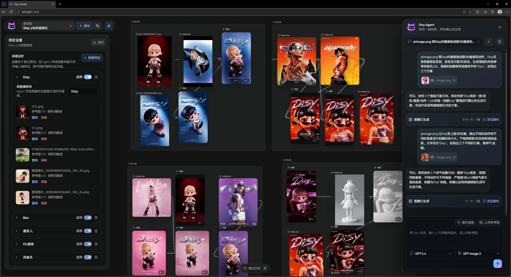
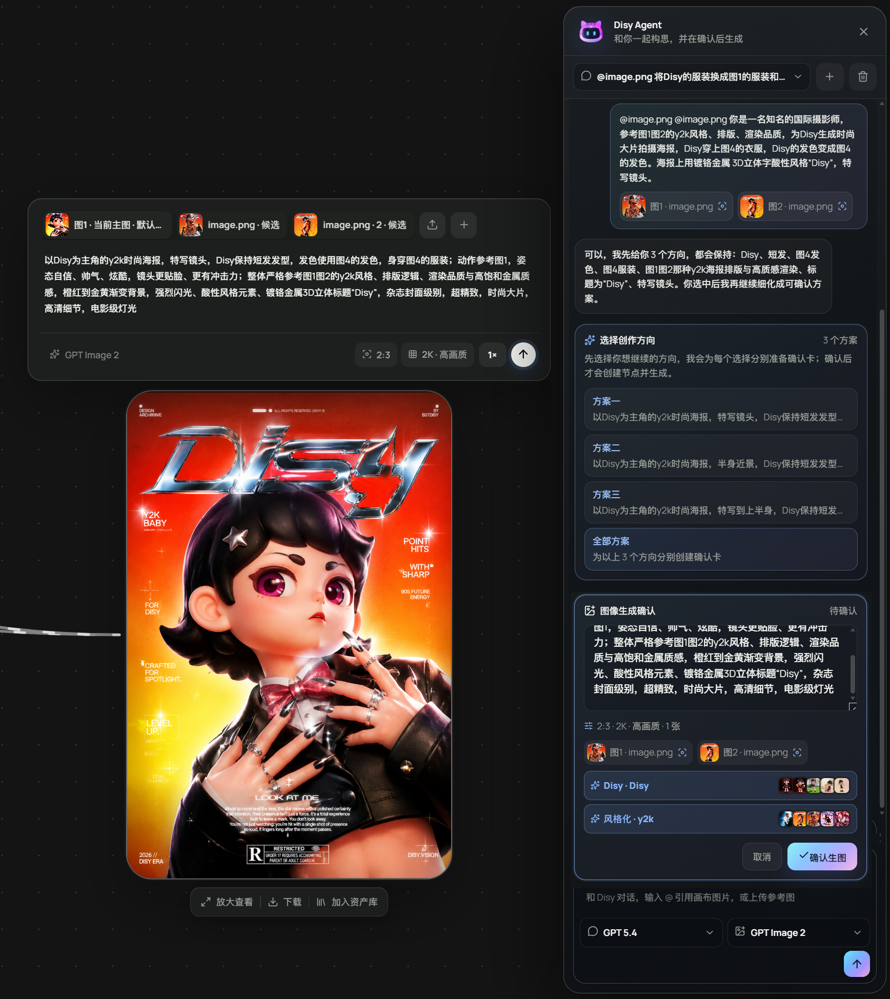
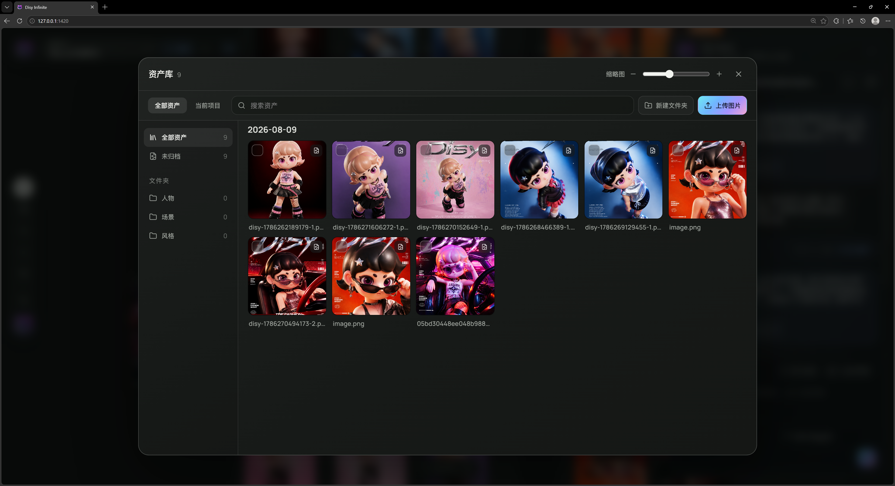

<p align="center">
  <picture>
    <source media="(prefers-color-scheme: dark)" srcset="docs/assets/logo-black.png" />
    <source media="(prefers-color-scheme: light)" srcset="docs/assets/logo-white.png" />
    
  </picture>
</p>

<h1 align="center">DisyLab Canvas</h1>

<p align="center"><strong>把灵感、参考素材、生成过程和可复用资产留在同一张会生长的画布上。</strong></p>
<p align="center">面向设计师、电商视觉工作者与内容创作者的本地优先 AI 无限画布。</p>

<p align="center">
  <a href="https://disylab.pages.dev/">在线体验</a> ·
  <a href="https://tyaash.github.io/DisyLab-Canvas/">项目介绍</a> ·
  <a href="#本地运行">本地运行</a> ·
  <a href="#部署">部署</a> ·
  <a href="README.en.md">English</a> ·
  <a href="README.zh-TW.md">繁體中文</a>
</p>

<p align="center">
  
  
  
  
  
</p>

> [!IMPORTANT]
> DisyLab 是源码公开可见（source-available）的专有软件，不是开源软件。未经书面许可，不得商用、售卖、白标、再分发或将本项目及其修改版本用于收费服务。详见[中文授权声明](LICENSE.zh-CN.md)与[英文许可证](LICENSE)。

## 产品概览

DisyLab 将文本、参考图、生成图片、生成视频、资产和 Agent 对话组织在可追溯的无限画布中。项目数据默认保存在浏览器本地，API Key 仅保存在当前浏览器会话，不写入仓库，也不由 DisyLab 托管。



## 核心能力

### 无限画布与创作资产

- 多项目、多画布、节点连接、组合、框选、小地图与可见区域性能优化。
- 文本、图片、视频、上传素材与工作流模板可在同一画布中组合。
- 资产库、生成历史、输出历史及 `.disy` 工作区导入导出。
- 系统剪贴板图片粘贴、参考素材引用和项目级风格预设。

### Disy Agent

- 基于当前项目、画布、选中节点、素材关系与历史对话构建上下文。
- 根据用户意图自动识别讨论/规划与执行请求，不向用户展示内部澄清标签。
- 图片、视频和文本方案在执行前提供可编辑确认卡。
- 每个图片或视频方案均可单独选择可用的连接与模型。
- Agent 在任务发起画布继续后台运行；用户可以切换到其他项目或画布，结果仍准确写回原位置。
- 长对话自动压缩为上下文摘要，减少信息丢失与重复提问。



### 图片与视频工作流

- 多 API 连接与模型目录，按文本、图片、视频能力分类。
- 图片多结果、画廊浏览、下载、宫格切分、扩图、本地抠图与局部修改。
- 文生视频、图生视频、首尾帧、图片参考和全能参考模式。
- 生成视频优先归档为本地 Blob；远程链接受 CORS、防盗链或签名影响时通过受控同源转发恢复。
- 视频支持下载、加入资产库、截取当前帧/首帧/尾帧、时间轴剪辑和画布内裁剪。
- HFSY、APIYI、Evolink、Visionary 等连接使用统一的错误诊断与媒体恢复流程。



### 本地工具与提示库

- 图片、视频和 PDF 的轻量本地处理。
- 内置可搜索提示库、参考案例和工作流模板。
- 图片与文本节点支持 Skill 调用、自定义 Skill 导入和参数化执行。

## 隐私与安全

- 项目、画布、资产、历史与 Agent 会话默认存储在 IndexedDB 或浏览器存储中。
- API Key 只保存在 `sessionStorage`，不会写入项目文件或 `.disy` 工作区包。
- 媒体代理仅允许受支持的 HTTPS 域名，并限制重定向目标。
- 请勿在 Issue、截图、聊天记录或提交中公开 API Key；发生泄露后应立即在服务商控制台撤销。

## 技术栈

| 分类 | 技术 |
|---|---|
| 前端 | React 19、TypeScript 6、Vite 8 |
| 样式 | Tailwind CSS 4、少量复杂画布/媒体交互 CSS |
| 画布与状态 | React Flow 12、Zustand 5、IndexedDB |
| 动效与 3D | Framer Motion、GSAP、Three.js |
| 文档与本地推理 | PDF.js、pdf-lib、Transformers.js |
| 校验与模板 | Zod、Handlebars |
| 边缘层 | Cloudflare Pages、Pages Functions |

## 本地运行

### 环境要求

- Node.js 22.12 或更高版本
- npm 10.8 或更高版本
- 最新版 Chrome 或 Edge

```bash
git clone https://github.com/TyaAsh/DisyLab-Canvas.git
cd DisyLab-Canvas
npm ci
npm run dev
```

默认地址：`http://127.0.0.1:1420/`

如需使用 APIYI 开发代理，可复制 `.env.example` 为 `.env` 并填写本地环境变量。不要提交 `.env`。

## 质量检查

```bash
npm run typecheck
npm test
npm run build
```

测试覆盖模型供应商生命周期、媒体转发安全、Agent 模式与上下文运行时、节点引用、故事板和提示库完整性。

## 项目结构

```text
src/                  React 应用、画布、Agent、媒体与本地数据层
functions/            Cloudflare Pages Functions 与受控媒体/API 转发
public/               运行时静态资源、提示库与工作流封面
scripts/              提示库维护、完整性检查与构建工具
docs/                 当前版本说明与公开产品文档
site/                 GitHub Pages 项目介绍页
.github/workflows/     GitHub Pages 自动发布工作流
```

主要入口：

- `src/App.tsx`：画布、项目、节点、资产与设置主界面。
- `src/AgentPanel.tsx`：Disy Agent 对话与方案确认界面。
- `src/agent.ts`：Agent 上下文、意图识别、方案解析与运行状态。
- `src/imageApi.ts`：模型目录、生成任务、轮询、媒体归档与错误诊断。
- `src/localDb.ts`：IndexedDB 工作区、画布、资产和 Agent 会话存储。
- `functions/apiyi/media.js`：生产环境媒体转发与安全校验。

## 部署

生产应用部署在 [Cloudflare Pages](https://disylab.pages.dev/)：

- Build command：`npm run build`
- Build output：`dist`
- Node.js：22.12+
- Pages Functions：仓库根目录 `functions/`

命令行发布：

```bash
npm run build
npx wrangler pages deploy dist --project-name disylab --branch main
```

`site/` 是独立的项目介绍页，由 `.github/workflows/pages.yml` 发布到 GitHub Pages；在线应用以 Cloudflare Pages 为准。

## 当前边界

当前版本聚焦浏览器端个人创作闭环，暂不提供账号系统、云端项目同步、多人实时协作、服务端 Key 托管或公共生成额度。桌面端与跨设备同步仍处于后续规划阶段。

## 文档与反馈

- [v1.0.5 版本说明](docs/Disy-v1.0.5-版本说明.md)
- [Skill 系统实施手册](docs/Disylab-Skill-实施手册.md)

反馈建议包含复现步骤、预期结果、浏览器/系统版本和模型名称；请勿附带 API Key。

- 小红书：Disy宇宙电波
- 邮箱：ashhaveaniceday@gmail.com

## 授权

Copyright © 2026 DisyLab. All rights reserved.

- [中文授权声明](LICENSE.zh-CN.md)
- [English License](LICENSE)
- [权利标记与第三方边界](NOTICE.md)
- [商业授权咨询](COMMERCIAL-LICENSE.md)

公开可见或可 fork 不代表获得商用、分发或衍生作品授权。任何商业许可均须由版权所有者另行书面确认。
